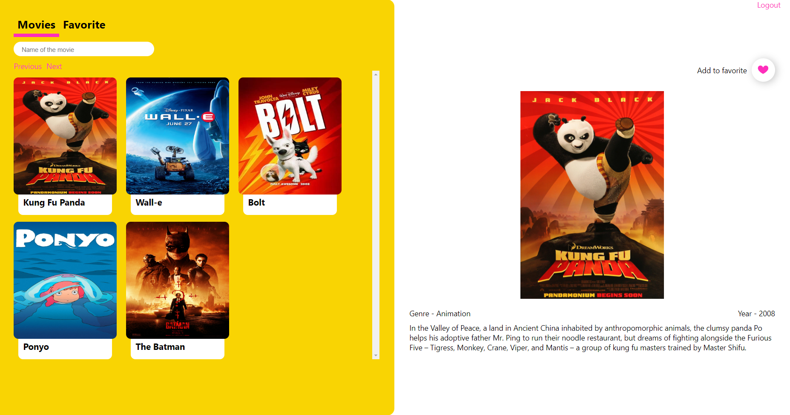
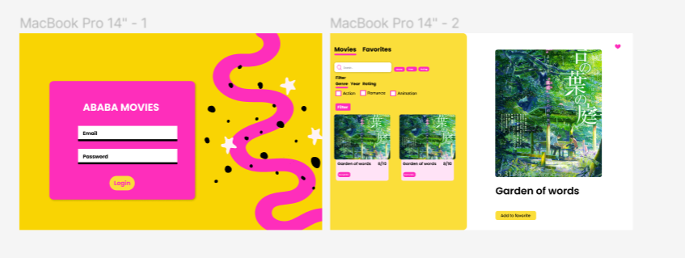
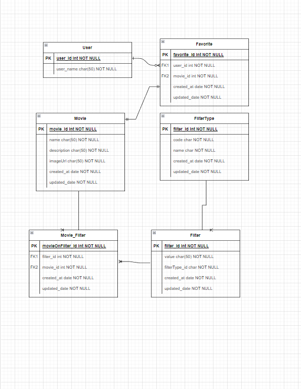

# Ababa movie project task by ababa.tech

## Ui of the project

If you login successully! You should see this home page.

# Planning

The way I have planned the project.

## Figma

At First I have designed the system in Figma.

[Figma Link](https://www.figma.com/file/1GZ7IVZoW3BsbMkTg5IXfc/Ababa-Favorite-Movie-list?node-id=2%3A2)

## Database

Then I designed the database.

# Backend

- Framework : Nest
- Orm: Prisma
- Database : Postgress
- Validation : class-validator
- Authentication : JWT (Passport)

## Routes

### Private

- /movies - (GET/POST)
- /filters - (GET/POST)
- /filterTypes - (GET/POST)
- /favorite - (GET/POST)

### Public

- auth/login - POST
- /users - POST

I have added all the routes in postman - [Postman collections](Postman)\
Published Link - [Visit](https://documenter.getpostman.com/view/4063810/UzBnrnLS)

# Frontend

- Library - React, Redux, React Router
- Package - React Hook Form, React Hot Toast
- Language - Typescript

## Features

- Pagination (Default page klimit is 10)\
   Managed pagination with custom [hook](client/src/hooks/usePagination.ts)
- Search with name (It's case sensitive!!)
- Managed the store with Redux Toolkit
- Managed Async operations with Redux Thunk and Axios
